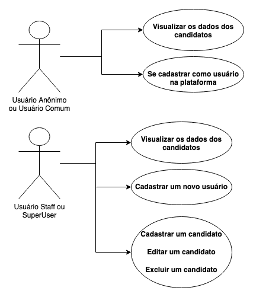
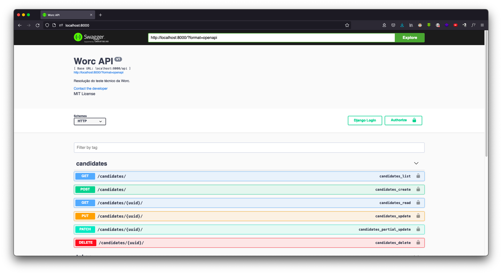
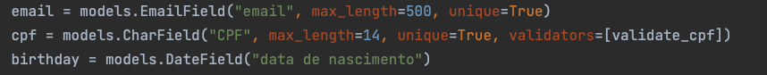
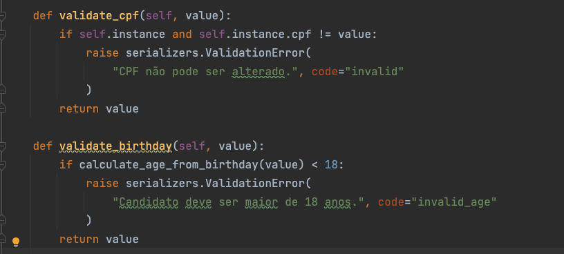

# worc

Projeto feito para a resolução do desafio técnico da Worc.

## Como executar a aplicação

Caso você tenha o docker instalado, basta executar o seguinte comando:
`docker-compose up -d --build`

Se não tiver o docker, nem o docker compose e quer instalar o projeto na mão, siga os seguintes passos:

- Baixe o Python, de preferência a versão 3.8 ou mais recente.
- Clonar o projeto: `git clone git@github.com:gabrielloliveira/worc.git`
- Entrar no diretório do projeto: `cd worc`
- Criar o virtualenv: `python -m venv env`
- Ativar o virtualenv: `source env/bin/activate`
- Instalar as dependências do projeto: `pip install -r requirements.txt`
- Rodar o setup inicial com as variáveis de ambiente: `python contrib/generate_env.py`
- Criar o banco de dados: `python manage.py migrate`
- Rodar o servidor: `python manage.py runserver`

## Estrutura dos arquivos/pacotes

- O projeto se chama `worc` e está localizado na pasta raiz do projeto.
- Dentro da pasta worc, eu tenho uma python package chamado `apps`. Nesta pasta, eu tenho todas as minhas apps 
que usarei no projeto (só precisei de duas, mas poderia ter mais, dependendo do projeto).

- A pasta `contrib` situada na raiz do projeto serve para fazer o "setup" do projeto. Nela,
coloquei um script que irá gerar um arquivo com as variáveis de ambiente "padrões" para o projeto.
- O arquivo `generate_env.py` é um script python que seta algumas variáveis de ambiente padrão para o projeto e cria 
um diretório chamado "logs" para armazenar os logs do projeto, configurados no arquivo de settings.

Para esta aplicação, devido ao objetivo do teste, que era o CRUD de 1 tabela, eu optei por criar 2 apps: uma app core,
que contém a tabela dos candidatos e outra app users, que contém o modelo de usuário da aplicação.

Se o problema descrito pedisse para criar outras entidades, como empresas, tabela de ponto, tabela que mostra 
as vagas das empresas, etc, provavelmente eu teria optado
por criar outras apps (companies, por exemplo).

## Explicando as decisões de design adotadas para a solução do desafio e organização do projeto

** Disclaimer: Todas as decisões sempre são tomadas pensando no futuro da aplicação, quem irá dar manutenção e 
se terá muita gente no time. Para ser mais direto, sempre tento programar de uma forma que possibilite um estagiário 
ou um júnior colocar a mão na massa logo no primeiro dia.

Na minha resulução, preferi colocar uma tabela de usuário para fazer autenticação e utilizar de recursos como JWT. Isso
porquê tive a sensação que estaria muito "exposto" se deixasse tudo aberto rsrs. Aqui está um resumo do que pode ser 
visto e feito dado o nível de usuário:

Pra gerenciar essas permissões, eu cria uma CustomPermission do projeto. Se chama `IsAdminOrReadOnly`.

As variáveis de ambiente são informações sensíveis. Gosto de gerenciá-las através do python-decouple.
Isso seria o ideal, pois, ao meu ver, torna mais fácil de manter o projeto. Se esse projeto
fosse ao ar, através de um heroku, tudo o que eu precisaria fazer seria substituir as variáveis de ambiente via painel
ou servidor, caso fosse uma VPS.

No entanto, muita gente adota o padrão de ter uma package settings. Dentro de settings, elas separam entre base.py, 
local.py e prod.py, por exemplo. Esse projeto não justifica essa abordagem. Então, preferi manter simples.

Da mesma forma que pode ser feito uma separação de settings, podeira também ser feito com o requirements.txt, separando
em dependencias de desenvolvimento, como o django-debug-toolbar, e de produção, como o gunicorn, sentry, etc.

Pra poder gerenciar isso tudo, muita gente utiliza o pipenv, embore eu ache que o poetry seja melhor. No entanto, 
mesmo assim, prefiro deixar tudo em um arquivo requirements.txt. Make it simple.

Os frontends precisam saber de tudo da API, de forma minunciosa. Por isso, adotei o swagger como documentação da API. 
Gerei a documentação utilizando a lib `drf-yasg`.

Os endpoints da aplicação são feitos através das GenericsAPIView do Django Rest. É um meio termo entre as 
APIViews e ModelViewSet. Acredito ser mais fácil de entender e manter, pensando em manutenções futuras e novas 
pessoas entrando no projeto. Mas também poderia ser feito com ModelViewSet, pois seria um classe de endpoint que 
serviria para todas as operações do CRUD.

Fiz testes automatizados utilizando o pytest, que, na minha opinião, é a melhor ferramenta que tem para testar.
Aproveitando isso, tomei a liberdade de configurar uma action de CI aqui no github. Toda vez que é feito um pull
request para a branch main (a branch principal), o CI executa os testes automatizados.

Eu gosto sempre de criar uma pasta de testes para cada app. Nela, posso organizar em testes de models, de views, 
de signals, etc.

Caso eu tivesse mais de um model, eu teria, por exemplo, um arquivo de `test_model_modelname.py`. Da mesma, faria isso 
para forma para os serializers e as views de cada entidade.

No problema do desafio, foi pedido para que pudesse ser possível pesquisar um candidato por algum campo específico.
Então, utilizei uma solução pronta, que é o django-filter. Através dele, posso setar o atributo filterset_class 
nos endpoints que quero e passar a classe que irá fazer o filtro. Essa abordagem é interessante, pois desacopla os 
filtros da lógica de view. (é muito comum ter vários filtros personalizados. Por consequência, a quantidade de linhas 
do método get_queryset() dos endpoints aumenta drasticamente.).

Agora, tratando da regra de negócio do projeto, que eram:
- O email e o CPF do candidato devem ser únicos
- O candidato deverá ter a idade maior ou igual a 18 anos
- O candidato não poderá ter seu CPF alterado

Eu coloquei a maior parte destas regras no model, pois é de responsabilidade do mesmo. Desta forma, esses validadores
servirão para outros casos (se a aplicação fizesse o uso de forms, por exemplo).

Apenas a validação de que o CPF não pode ser alterado é feita no serializer, através do método padrão 
`validate_field_name`.

Uma outra abordagem que poderia ser feita no serializer, seria criar uma classe `CandidateBaseSerializer`, que conteria
todos os campos comuns do serializer. Após isso, eu poderia ter dois srializers: 
`CandidateCreateSerializer(CandidateBaseSerializer)` e `CandidateDetailSerializer(CandidateBaseSerializer)`. A 
única diferença entre eles dois seria o fato do CPF ser um `ReadOnlyField` no serializer de Detail. Isso é bastante 
comum em diversos projetos.

Uma curiosidade é que eu poderia ter utilizado alguns campos como `CPFField()` que existem numa lib que eu 
criei https://github.com/gabrielloliveira/django-cpf.
Porém, optei por adicionar somente o validator que eu utilizo na minha lib neste projeto.

## Descreva sua API REST de forma simplificada.

Deixei um arquivo de Insomnia na raiz do projeto que serve de exemplo de requests já prontas.

Para a entidade de candidatos, tenho 2 endpoints:
`{URL_BASE}/api/candidates/` e `{URL_BASE}/api/candidates/{uuid}/`.

Como padrão do REST, o primeiro endpoint aceita os métodos GET e POST, como listagem e 
criação de candidatos, respectivamente.

O segundo endpoint aceita os métodos GET, PUT, PATCH e DELETE, como listagem, edição, edição parcial e exclusão de um 
candidato, respectivamente.

Lembrando que todo endpoint com um método que provoque um efeito colateral na base de dados, como o POST, PUT, 
PATCH e DELETE, deve ser feita através de um token de autenticação no cabeçalho da requisição.
Fazemos isso com:
`Authorization: Bearer {TOKEN}`

Utilizei a lib `djangorestframework-simplejwt` para lidar com a autenticação em JWT.

Já na entidade de usuário, tenho 3 endpoints:

    * Cadastro de usuário: POST {URL_BASE}/api/users/
    * Pegar o token do usuário/fazer login: POST {URL_BASE}/api/token/
    * Atualizar o token: POST {URL_BASE}/api/token/refresh/

